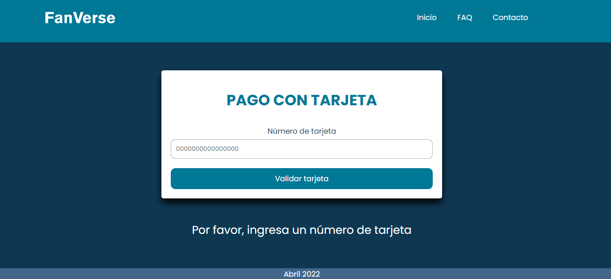

# FanVerse: Validar tarjeta de crédito

## Índice

* [1. Preámbulo](#1-preámbulo)
* [2. Usuarias](#2-usuarias)
* [3. Objetivos de aprendizaje](#3-objetivos-de-aprendizaje)
* [4. Consideraciones generales](#4-consideraciones-generales)
* [5. Criterios de aceptación mínimos del proyecto](#5-criterios-de-aceptación-mínimos-del-proyecto)
* [6. Pistas, tips y lecturas complementarias](#6-pistas-tips-y-lecturas-complementarias)

***

## 1. Preámbulo

El [algoritmo de Luhn](https://es.wikipedia.org/wiki/Algoritmo_de_Luhn),
también llamado algoritmo de módulo 10, es un método de suma de verificación,
se utiliza para validar números de identificación; tales como el IMEI de los
celulares, tarjetas de crédito, etc.

Este algoritmo es simple. Obtenemos la reversa del número a verificar (que
solamente contiene dígitos [0-9]); a todos los números que ocupan una posición
par se les debe multiplicar por dos, si este número es mayor o igual a 10,
debemos sumar los dígitos del resultado; el número a verificar será válido si
la suma de sus dígitos finales es un múltiplo de 10.


## 2. Usuarias

Este proyecto está dirigido a usuarias pertenecientes a una población de fans. La página simula el entorno de un servicio con base en membresías. En este, las usuarias adquieren dicha membresía para acceder a contenido digital exclusivo. La interfaz para validar tarjeta está pensada para implementarse durante el proceso de validar el pago de la membresía.

## 3. Objetivos de aprendizaje

Reflexiona y luego marca los objetivos que has llegado a entender y aplicar en tu proyecto. Piensa en eso al decidir tu estrategia de trabajo.

### HTML

- [x] **Uso de HTML semántico**


### CSS

- [x] **Uso de selectores de CSS**


- [x] **Modelo de caja (box model): borde, margen, padding**

 

### Web APIs

- [x] **Uso de selectores del DOM**


- [x] **Manejo de eventos del DOM (listeners, propagación, delegación)**


- [ ] **Manipulación dinámica del DOM**


### JavaScript

- [ ] **Tipos de datos primitivos**

 
- [x] **Strings (cadenas de caracteres)**

  
- [x] **Variables (declaración, asignación, ámbito)**


- [x] **Uso de condicionales (if-else, switch, operador ternario, lógica booleana)**

  
- [x] **Uso de bucles/ciclos (while, for, for..of)**


- [x] **Funciones (params, args, return)**

  
- [x] **Pruebas unitarias (unit tests)**


- [ ] **Módulos de ECMAScript (ES Modules)**


- [x] **Uso de linter (ESLINT)**

- [x] **Uso de identificadores descriptivos (Nomenclatura y Semántica)**

### Control de Versiones (Git y GitHub)

- [x] **Git: Instalación y configuración**

- [ ] **Git: Control de versiones con git (init, clone, add, commit, status, push, pull, remote)**

- [x] **GitHub: Creación de cuenta y repos, configuración de llaves SSH**

- [x] **GitHub: Despliegue con GitHub Pages**


### user-centricity

- [ ] **Diseñar un producto o servicio poniendo a la usuaria en el centro**

### product-design

- [ ] **Crear prototipos de alta fidelidad que incluyan interacciones**

- [ ] **Seguir los principios básicos de diseño visual**


### Scripts / Archivos

#### General

En la interfaz final, la usuaria está en la etapa final de validar si el número de tarjeta ingresado es válido o no.




##### `src/index.html`

En este archivo se maqueta el contenido general de la página web.

* `<header>`: Encabezado con logotipo y otras páginas de navegación (solo de muestra).
* `<main>`: El contenido principal de la página, es decir, el formulario de ingreso de número de tarjeta.
* `<footer>`: Pie de página con información sobre la página.

##### `src/style.css`

Este archivo contiene las reglas de estilo.

#### Funcionalmente (JavaScript - pruebas unitarias)

##### `src/index.js`

En este archivo se realiza la manipulación del DOM.
Se establecen las condiciones para no permitir a la usuaria ingresar caracteres diferentes a números del 0 al 9.


##### `src/validator.js`

Contiene
dos métodos (`isValid` y `maskify`):

* **`validator.isValid(creditCardNumber)`**: `creditCardNumber` es un `string`
con el número de tarjeta que se va a verificar. Esta función debe retornar un
`boolean` dependiendo si es válida de acuerdo al [algoritmo de Luhn](https://es.wikipedia.org/wiki/Algoritmo_de_Luhn).

* **`validator.maskify(creditCardNumber)`**: `creditCardNumber` es un `string` con
el número de tarjeta y esta función debe retornar un `string` donde todos menos
los últimos cuatro caracteres sean reemplazados por un numeral (`#`) o 🐱.
Esta función deberá siempre mantener los últimos cuatro caracteres intactos, aún
cuando el `string` sea de menor longitud.

    Ejemplo de uso

    ```js
    maskify('4556364607935616') === '############5616'
    maskify(     '64607935616') ===      '#######5616'
    maskify(               '1') ===                '1'
    maskify(               '')  ===                ''
    ```


##### `test/validator.spec.js`

En este archivo tendrás que completar las pruebas unitarias de las funciones
`validator.isValid(creditCardNumber)` y `validator.maskify(creditCardNumber)`
implementadas en `validator.js` utilizando [Jest](https://jestjs.io/es-ES/).
Tus pruebas unitarias deben dar un 70% en _coverage_ (cobertura),
_statements_ (sentencias), _functions_ (funciones) y _lines_ (líneas); y un
mínimo del 50% de _branches_ (ramas).

***

